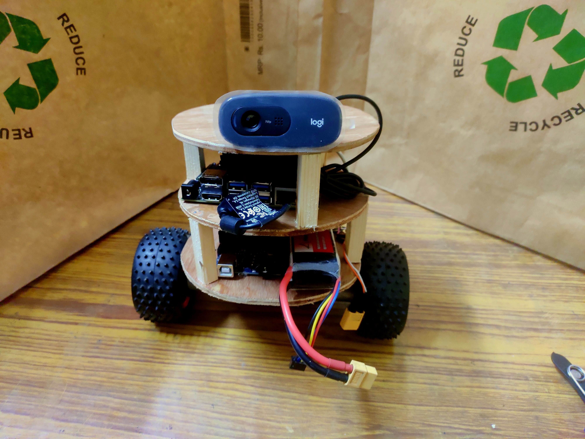

# PauciBot-Hardware

## Abstract
This Repository contains the hardware designs of the Two Wheeled ROS enabled robot capable of self - balancing and also able to run SLAM and Localize itself with just Odometry, Encoders on the wheel and the Camera used with Depth Maps[[1]]() to get a partially accurate Depth information of the surronding. This is partially inspired from the Turtlebot[[2]]() but it must be kept in mind the algorithm has be able to model the two wheeled bot to even account for its self balancing action which was solved using accurate System Modelling[[3]]().

## Design

## References
A Tutorial on Modelling and Control of Two- Wheeled Self-Balancing Robot with Stepper Motor https://www.researchgate.net/publication/334731253_A_Tutorial_on_Modelling_and_Control_of_Two-_Wheeled_Self-Balancing_Robot_with_Stepper_Motor
