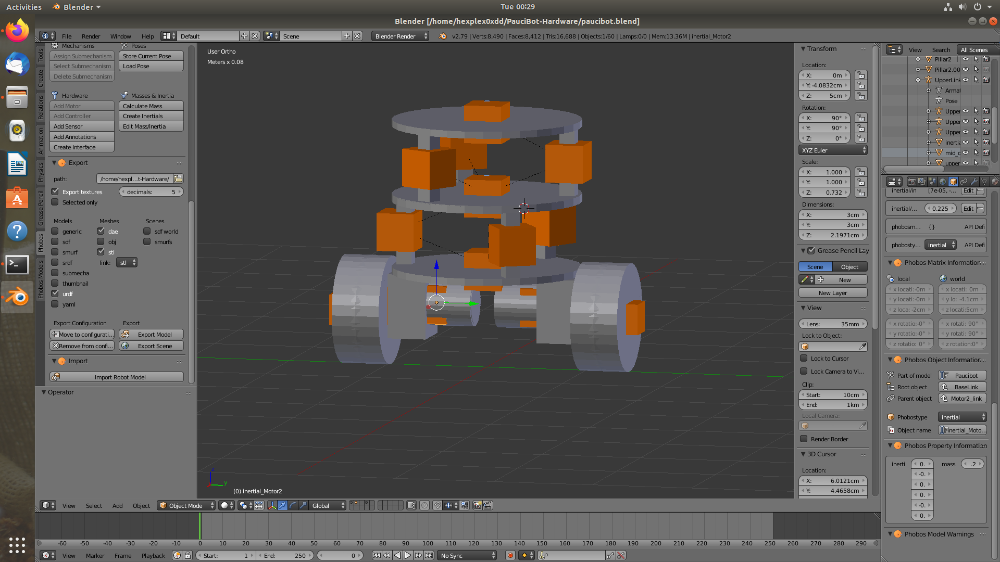

# PauciBot-Hardware

## Abstract
This Repository contains the hardware designs of the Two Wheeled ROS enabled robot capable of self - balancing and also able to run SLAM and Localize itself with just Odometry, Encoders on the wheel and the Camera used with Depth Maps[[1]](#1) to get a partially accurate Depth information of the surronding. This is partially inspired from the Turtlebot[[2]](#2) but it must be kept in mind the algorithm has be able to model the two wheeled bot to even account for its self balancing action which was solved using accurate System Modelling[[3]](#3).


## Design
The above is the bot in all its glory, I had built The Hardware before running simulations and testing out its stability as its quite an symmetrical and simple design. This surely resembles turtlebot but has a few changes. Basically the idea was to have a worthy replacement for a turtlebot to test out all the mapping and planning algorithms on it.

<br/>

After the construction it was quite easy to make a 3D design for the simulators. My Weapon of choice Phobos[[4]](#4) and [Blender](https://www.blender.org/).

Below is a simple design of the bot in blender.


With some Phobos magics :tada::tada:



We can set the parameters required for generating URDF of the bot.

Exporting it just makes the work run naturally with Gazebo, PyBullet and any other Simulator of choice. The below is a simple **PID control on the Pitch** of the Bot.


You can get the same output running the following in the terminal.
```bash
git clone https://github.com/hex-plex/PauciBot-Hardware.git
cd PauciBot-Hardware
python scripts/trial.py
```

## Under-Development
The Main objective was that I wanted to explore the Difficulties faced when taking the Project from simulation to reality and vice versa. The Main tool is **ROS** as its a well established community with most useful tools opensourced for all. Hence I would like to release The bot with a ROS package. I have been currently working on the same for the past few months.

Hope to see you there soon. : )

## Components
The whole body is made of Ply wood and solid wood. And the wheels are just off the shelf RC car wheels with a 11.1 V LiPo battery.
- #### Arduino Mega 2560
I have used this for controlling the motor drivers and getting a Odometry and runnning a baseline self balancing algorithm.
- #### Nvidia Jetson Nano 4GB
This is the ROS hardware Node on the Robot which communicates to a master on the localhost using UDP protocol. This is also used to give the neccesary computational power for onboard Computer Vision algorithms.

- #### MPU9250
Simple sensor for Odometry.
- #### L298 Motor Driver
Motor driver for controlling 2 Motors
- #### LM2596S Buck
For regulating voltage comming from the battery.
- #### Logitech C290
This is a high quality webcam that can be easily used for capturing images at incredibly high resolution and quality.


## References
<a id="1">[1]</a> Unsupervised Learning of Depth and Ego-Motion from Monocular Video Using 3D Geometric Constraints. Reza Mahjourian, Martin Wicke, Anelia Angelova [[link]](https://sites.google.com/view/vid2depth)

<a id="2">[2]</a> Turtlebot is a ROS standard platform robot. [[link]](https://emanual.robotis.com/docs/en/platform/turtlebot3/overview/)

<a id="3">[3]</a>
A Tutorial on Modelling and Control of Two- Wheeled Self-Balancing Robot with Stepper Motor [[link]](https://www.researchgate.net/publication/334731253_A_Tutorial_on_Modelling_and_Control_of_Two-_Wheeled_Self-Balancing_Robot_with_Stepper_Motor)

<a id="4">[4]</a> Phobos is an add-on for Blender. [[link]](https://github.com/dfki-ric/phobos)
